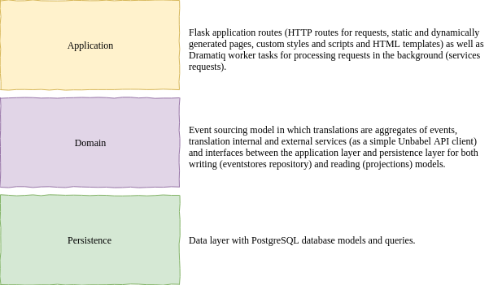
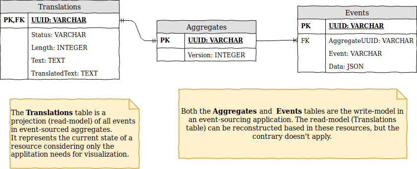
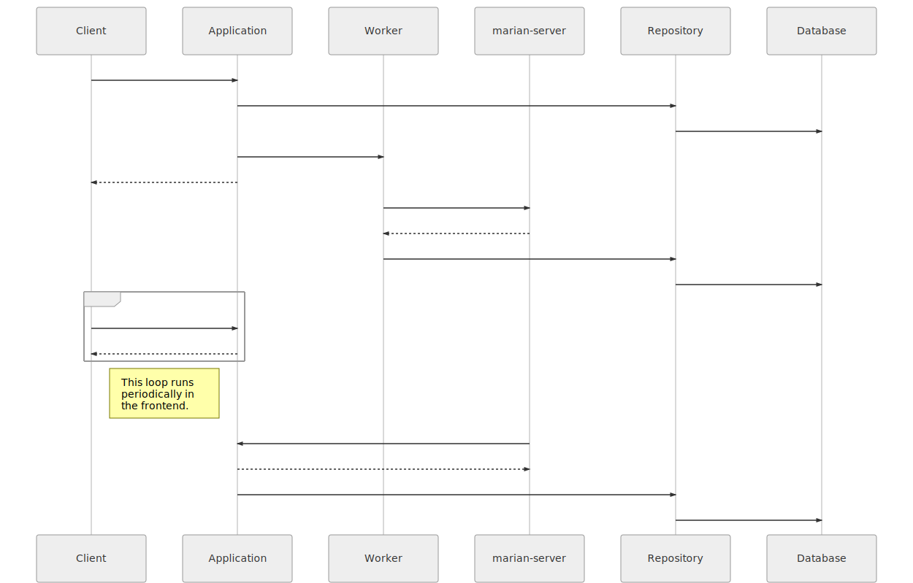
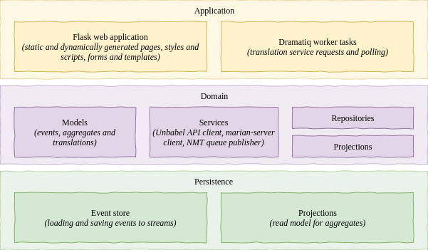
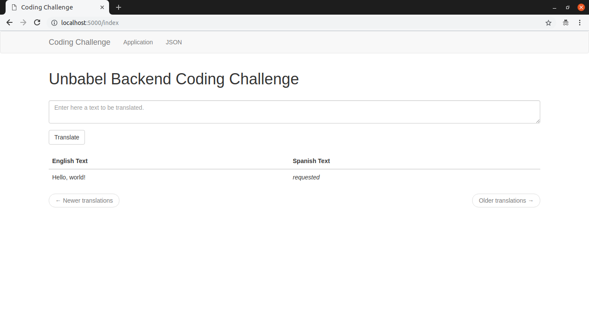

# Unbabel Applied AI Challenge

Hello again, Unbabel recruiting team!

This is my (incomplete) solution to the [Unbabel Applied AI Challenge](https://github.com/Unbabel/applied-ai-backend-coding-challenge), based on [my previous solution](https://github.com/barbozav/backend-coding-challenge) to the Unbabel Backend Challenge.

Previously, I've developed a Flask web application which translates input text from English to Spanish using Unbabel's API. Tests were implemented for the domain layer - covering the translation services, event-sourcing model and repositories.

As I've chosen a domain-driven architecture, this solution integrates the Marian-decoder as a new translation service with small changes only.

Documentation consists on this README.md and source code documentation (_docstrings_). Text from the original documentation will be _italic_.

#### What is missing?

Before continuing with this documentation, I'm summarizing what is missing (and why) as the solution is incomplete. The following bullets are in chronological order:

* It has been quite some time I've been developing this solution and I've decided it was time to let it go.

* I had problems compiling Marian-NMT (both the `master` branch and the  `1.7.0` tag) due to lack of computer power, my configurations follow:

  * Intel® Core™ i5-2410M CPU @ 2.30GHz × 4 with an integrated VGA (no CUDA) and 8GB of RAM;
  * Ubuntu 18.10;
  * gcc 8.2.0;

  * libBLAS (from Ubuntu repositories) instead of CUDA or MKL;
  * `$ cmake .. -DCOMPILE_CUDA=off` for configuring the build;
  * Compilation stops at 88% with `microsoft/quicksand.cpp.o`.

* I was suggested to use `1.6.0`, which compiled fine, however default training configurations (following the [Quick Start](https://marian-nmt.github.io/quickstart/) and [Documentation](https://marian-nmt.github.io/docs/)) also crashes my computer.

* I tried to "guess and check" good parameters for training a model with Marian-NMT without running out of CPU or RAM - usually reducing vocabulary size, number of generations, number of batches, workspace memory and RNN dimensions.

* I tried a few corpus available here: http://opus.nlpl.eu/index.php

* The *do-able* training would result in bad translations (*garbage in - garbage out*).

* I've considered running everything (latest version compilation, training and translation) in a GCP instance, but it would take me quite some time to configure everything.

* In a few days, I've written a RabbitMQ consumer in C++ (see tag [*rabbitmq-consumer*](https://github.com/barbozav/applied-ai-backend-coding-challenge/tree/rabbitmq-consumer)) with empty room for a translation library, but it's been quite some time already.

* In a single day, I've build a Docker image with `marian-server` running which doesn't meet the challenge requirements, but responds to the websockets requests from the Flask application.

* Even though the `marian-server` works locally, it logs an "Not implemented!" error when responding to the Flask application.

* I've decided to deliver the partial/incomplete solution.

## Requirements

* *[Docker](https://www.docker.com/)*
* *[docker-compose](https://docs.docker.com/compose/)*
* *[ngrok](https://ngrok.com/) (optional for HTTP tunneling and receiving callbacks)*

## TL;DR

* *Start `ngrok`on HTTP port 5000:*

  ```bash
  ./ngrok http 5000
  ```

* *Copy the `.env.template` to a `.env` file and set the required environment variables.*

* *Run the application:*

```bash
docker-compose up -f docker-compose.yml --build
```

* *Access it:*

  *http://localhost:5000/*

## Roadmap and references

Here I try to break the steps I took to develop the solution - which is described later in this document.

My references are linked here alongside with the roadmap topics - some I've already implemented for other projects and some I've had to study for this challenge.

1. Fork the project. **[OK]**
2. Re-use [Unbabel Backend Challenge](https://github.com/barbozav/backend-coding-challenge) source code. **[OK]**
3. Update the README file (Introduction and Roadmap). **[OK]**
4. Study the [Marian-decoder](https://marian-nmt.github.io/). **[OK]**
5. Impement a simple application with the Marian-decoder. **[OK]**
6. Study RabbitMQ library for C++. **[OK]**
7. Implement a simple RabbitMQ consumer in C++. **[OK]**
8. Study CURL library for C++. **[OK]**
9. Implement a POST to the application callback URL. **[OK]**
10. Configure a Makefile. **[OK]**
11. Configure RabbitMQ and re-configure Dramatiq. **[OK]**
12. Implement a machine-translation task. **[OK]**
13. Implement a RabbitMQ publisher. **[OK]**
14. Update the docker-compose. **[OK]**
15. Implement the MT service client. **[OK]**
16. ~Test the MT service client.~
17. Update the `Translator` class to support the MT service. **[OK]**
18. ~Test the `Translator` class.~
19. Improve the callback endpoint. **[OK]**
20. Improve the frontend. **[OK]**
21. ~Write _docstrings_.~
22. ~Generate HTML documentation with [Sphinx](http://www.sphinx-doc.org/en/master/) and [doxygen](http://www.doxygen.nl/).~
23. Update the a README (Sequence diagrams and documentation). **[OK]**
24. Organize commits with `git rebase` and clean feature branches. **[OK]**
25. Deliver it. **[OK]**

## Solution design

*I've designed the application in a simple domain-driven approach trying to keep the Flask application (application layer), the translations logic (domain layer) and the data operations (persistence layer) isolated. The following diagram summarizes the architecture described in the next sessions.*



### Application layer

*My Flask reference is [Miguel Grinberg's Flask Mega-Tutorial book](https://blog.miguelgrinberg.com/post/the-flask-mega-tutorial-part-i-hello-world) which I have initially followed but as it uses available Flask extensions for everything, it makes too difficult to decouple the application layers.*

For settings management I am using `dynaconf` and its Flask extension. For the background tasks, I let `Dramatiq` handle the queues using `RabbitMQ`.

*For the frontend, I am using `Flask-Bootstrap` styles, `Flask-WTF` forms and AJAX to poll the translations list.*

### Domain layer

*For the translation services, I've chosen an event-sourcing approach (based on [this series of blog posts](https://breadcrumbscollector.tech/implementing-event-sourcing-in-python-part-1-aggregates/)) to properly handle the translation service status changes. My interpretation of the problem suggests the following logic:*

* _**requested:** As soon as an input text is submitted to our application via the HTML forms, it is considered a requested translation._
* **pending:** After sent to a translation service (Unbabel API or a Marian-NMT server), its status changes from requested to pending and we have to wait until its completion (as we are requesting manual translations).
* _**finished:** When the translation service completes processing the input text (translating it from English to Spanish) and sends a POST to a callback URL in the application, our translation status changes to finished._

*All status changes are recorded as events in an event aggregate (which is a `Translation` object). This way, instead of having only the final state of an object, we can track down every modification (e.g. timestamps) and add other events to the logic in the future (other translation services appending to the events stream - internal x external services, automatic x manual services, etc).*

*To query and visualize this information, though, I've implemented a simple read-model of the event-sourced aggregate containing the current state of every translation and required information as the string length for ordering the translations list.*

### Persistence layer

*The persistence layer is implemented with `SQLAlchemy` and a PostgreSQL database.*

> ***Note:** _Currently, we have a PostgreSQL container running within the same `docker-compose` the application runs. This is definetely not the best approach - the schema and tables are recreated everytime (or persisted in an external volume).*
>
> *This setup could be easily changed in the `.env` file assigning to a proper hosted PostgreSQL database to the database URI environment variable instead.*

*The write-model for event-sourcing is implemented with 2 tables. One for **Aggregates** and another for **Events**. The read-model for visualization (which can be generated from the write-model on demand) is a single **Translations** table. Other projections could be added (e.g. read-models for management, auditing or analytics).*

*The following schema represents the implemented challenge schema.*



> ***Note:** The `Version` column in the Aggregates table is used as an optimistic lock - if 2 transactions attempt to update the same resource, the first one will complete and increment this value. Then, the second will try to update a version that doesn't exist anymore and fail. It's a simple mechanism of robustness*

## Application steps

*The following sequence diagram is a simple "good path"-only diagram illustrating the most important components calls and behaviors. It doesn't cover all paths (e.g. ignoring error handling) and it doesn't include the read-model (projections) when updating clients. Although, it's a good "mind map" of what is happening when a new translation is requested in a browser and sent to our application.*

This diagram covers the automated translation scenario using marian-server as our translation-service.



## Project organization

### Revision control

*This project follows a [Karma git](https://karma-runner.github.io/3.0/dev/git-commit-msg.html)-sh style for commit messages.*

*The single production, staging and development branches is avoided and feature branches were used instead.*

*As soon as feature branches are merged into master, they were removed.*

### Python Source Code

*The root directory contains all configuration files required:*

* *`.gitignore `and `.dockerignore`;*
* *`requirements.txt` with required Python packages;*
* *`.env.template` with environment variables which must be set before running;*
* *`docker-compose.yml` files  and `Dockerfile` for building and deploying the application;*
* *`docker-compose.tests.yml` and `Dockerfile` files for building and testing the application.*

*The application is developed as a `challenge` package and, as described above, it isolates the web application from the application domain and data persistence layers. The following image illustrates it with more details.*



*For development, I've used `virtuallenvwrapper` and Visual Studio Code. All Python files were linted with `Flake8` (which is faster), `pylint` (which covers more issues), `pydocstrings`, formatted with `yapf` and `isort`.*

### C++ Source Code (*rabbitmq-consumer*)

The `nmt` directory contains the C++ worker project for the automated translation service:

- `Makefile` for building and running the worker;
- `src` where the main consumer loop application resides;
- `src/marian` as a submodule for Marian-NMT;
- `src/worker/` where the RabbitMQ consumer and translation class resides.

### Bash Source Code (*marian-server*)

The `marian` directory contains scripts for building, training and running Marian-NMT.

- `Makefile` for building and running the worker;
- `src` where the main consumer loop application resides;
- `src/marian` as a submodule for Marian-NMT;
- `src/worker/` where the RabbitMQ consumer and translation class resides;
- `Dockerfile` for building a `marian-server` image.

### Tests

*As time ran short and I still need to learn how to properly test a web application from end-to-end, I've decided to test the core of this project, focusing on the happy path. There are no tests implemented for the application layer or persistence layer, but the essential classes of the domain layer were tested:*

* *The Unbabel's API client;*
* *The Translator service;*
* *The event-sourcing model (Aggregates, Events and Translations);*
* *The event-source aggregates Repository class.*

*Not all tests are isolated unit tests - this way testing the repository also stresses PostgreSQL queries from the Persistence layer, for instance. Most of these tests were implemented with `Hypothesis` Python package, which does a good job automatically generating tests cases (and corner cases).*

*The frontend tests are excluded as the application routes, templates and read-model. Studying `Selenium` could apply here.*

*A simple browser debugger or extension is capable of returning the average load time of the application `/index` page - which is around 150 ms. A better approach would be test it with `Locust` or `JMeter` and do a proper analysis - scaling worker processes and threads as necessary.*

### Build, tests and deploy

*There are `docker-compose` files for running both the application and tests with their dependencies (Redis and PostgreSQL). To do so, follow these steps:*

1. *Start an HTTP tunnel to the local port 5000 - the Unbabel's API will need a callback URL. I'm using [ngrok](https://ngrok.com/), but there are other solutions available.*

```bash
./ngrok http 5000
```

2. *Edit the `.env.template` file with the required environment variables (see the following snippet). Save it as `.env`.*

```bash
###############################################################################
# CONFIGURE THE FOLLOWING ENVIRONMENT VARIABLES BEFORE RUNNING!
###############################################################################

# API client
UNBABEL_API_CLIENT=

# API token
UNBABEL_API_TOKEN=

# API callback URL. Please, consider the following:
#    - The format MUST be 'http[s]://<host>/callback/' (with quotes).
#    - The host might be a Ngrok HTTP tunnel to your local port 5000.
#    - The endpoint MUST be "callback" as it's implemented this way.
#    - The last slash ("/") MUST be explicit
UNBABEL_API_CALLBACK=

###############################################################################
# DO NOT EDIT ANYTHING FROM NOW ON
###############################################################################

...

```

3. *Run tests.*

```bash
docker-compose up -f docker-compose.tests.yml --build --force-recreate
```

*After finishing, you will need to stop the docker-container by yourself (`CTRL + C` will do).*

```bash
challenge_app | =================== test session starts ====================
challenge_app | platform linux -- Python 3.6.7, pytest-4.1.0, py-1.7.0, pluggy-0.8.0
challenge_app | hypothesis profile 'default' -> database=DirectoryBasedExampleDatabase('/src/.hypothesis/examples')
challenge_app | rootdir: /src, inifile:
challenge_app | plugins: hypothesis-3.86.5
challenge_app | collected 28 items
challenge_app | 
challenge_app | tests/domain/test_repositories.py ..                                     [  7%]
challenge_app | tests/domain/model/test_base.py .....                                    [ 25%]
challenge_app | tests/domain/model/test_translation.py ...........                       [ 64%]
challenge_app | tests/domain/services/test_translator.py ...                             [ 75%]
challenge_app | tests/domain/services/unbabel/test_client.py .......                     [100%]
challenge_app | 
challenge_app | ===================== warnings summary =====================

...

challenge_app | ========= 28 passed, 4 warnings in 111.67 seconds ==========
challenge_app exited with code 0

```

4. *Run the application.*

```bash
docker-compose up -f docker-compose.yml --build
```

5. *Access the application using the HTTP tunnel or http://localhost:5000/*



## Known Issues (or Next Steps)

*The following issues are known and yet to be fixed:*

* The current NMT model was trained with few iterations over a small vocabulary (due to computing limitations) resulting in poor translations - a better model should be used instead.
* The integration of the C++ worker is through the Marian-NMT server, but the `marian` code could be compiled as a library to make it a single application.
* The solution is incomplete and the documentation is not as good and up-to-date as the previous delivered challenge.
* *After some time, the AJAX polling loses connection with the PostgreSQL database. It requires further investigation, but implementing the event server with `Flash-SSE` could do.*
* *After the translations list is dynamically updated, the "Newer translations" and "Older translations" buttons are not. It's required to refresh the page after 10 entries to do so.*
* *Escape characters are returned from the PostgreSQL, sent to the translation services and printed in the frontend as well. Some translators deal with it, others don't.*
* *There are no control over requests (to the databases or APIs). `Tenacity` could be of help.*
* *There are insufficient tests for the application and persistence layer.*
  * *There are no stress tests to say the application is scalable.*